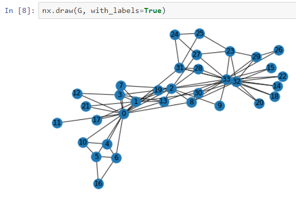
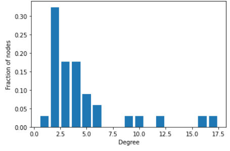

# coursera_5_social_network_analysis
My work from Coursera's Applied Social Network Analysis in Python course, the fifth and final course in the data science specialization through UM. The course is hosted here: <https://www.coursera.org/learn/python-social-network-analysis>

# Author info
Patricia Schuster  
University of Michigan  

# Week 1: What is a network?

* [Notes](week_1_notes.ipynb)
    * Types of networks: undirected, directed, weighted, signed, multigraphs  
    * Edge attributes, node attributes  
    * Bipartite graphs  
    
* [Assignment 1](Assignment+1.ipynb)  
    * Generate a bipartite graph from data in a text file  
    * Create nodes for employees and movies  
    * Calculate Pearson correlation coefficients to see whether employees have any movies in common  

# Week 2: Network connectivity

* [Notes](week_2_notes.ipynb)  
    * Clustering coefficient  
    * Distance measures: average shortest path length, diameter, eccentricity, radius, periphery, center  
    * Connected components  
    * Network robustness  
* [Lab](week_2_lab_visualizing_with_networkx.ipynb)  
    * Loading graphs from various file formats, including adjency matrix, edgelist, or pandas DataFrame  
    * Generate and analyze graph of chess plays from file  

Much of this week uses the data from the karate club dataset:

* [Assignment 2](Assignment+2.ipynb)  
    * Import and analyze an internal email communicate network of employees at a mid-sized company  
    * Load the graph, assess its size, and evaluate connectivity      
    
# Week 3: Influence measures and network centralization

* [Notes](week_3_notes.ipynb)  
    * Degree and closeness centrality  
    * Betweenness centrality  
    * Basic page rank  
    * Hubs and authorities  
    
* [Assignment 3](Assignment+3.ipynb)  
    * Explore measures of centrality on a friendship network and a blog network  
    * Use shopping data to predict which customers should receive a coupon  
    * Use the HITS algorithm to explore a network of political blogs  
    
# Week 4: Applications

* [Notes](week_4_notes.ipynb)  
    * Preferential attachment network, degree distributions  
    * Small world networks  
    * Link prediction  
    

    
* [Assignment 4](Assignment+4.ipynb)    
    * Evaluate five graphs and determine whether they were generated using preferential attachment or small world algorithms  
    * Look at employment data and predict which employees should receive a management salary  
    * Predict which employees are likely to build new connections within the company  